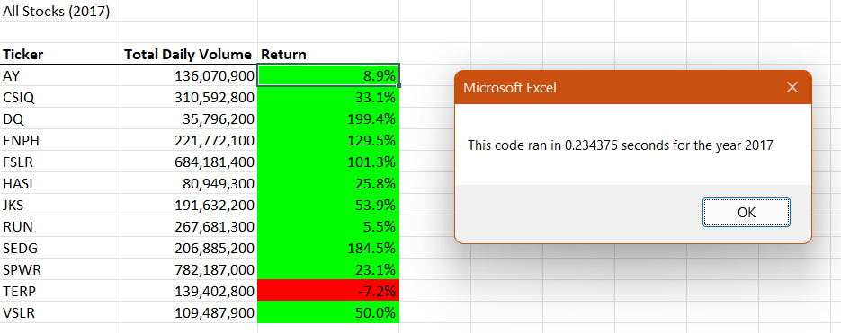
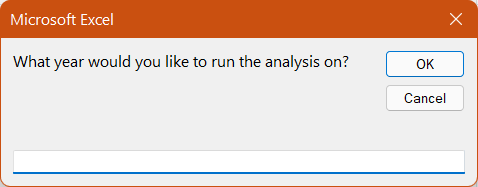
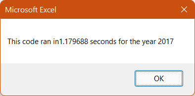
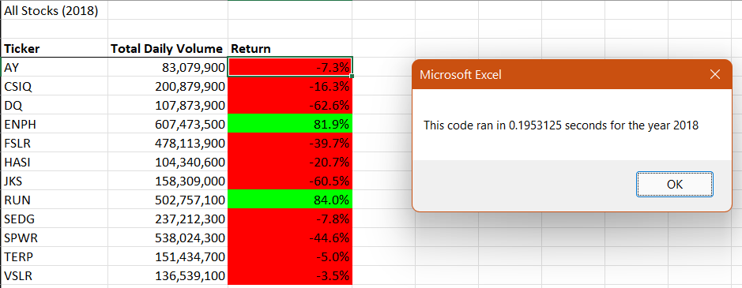
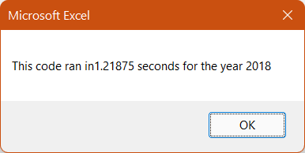

# Green Stock Analysis with Visual Basic



## <div align="center">Utilize Visual Basic to build an Excel program that analyzes stock data</div>

<p align="center">
<a href="#goal">Goal</a> &nbsp;&bull;&nbsp;
<a href="#dataset">Dataset</a> &nbsp;&bull;&nbsp;
<a href="#tools-used">Tools Used</a> &nbsp;&bull;&nbsp;
<a href="#analysis-and-challenges">Analysis and Challenges</a> &nbsp;&bull;&nbsp;
<a href="#results">Results</a> &nbsp;&bull;&nbsp;
<a href="#summary">Summary</a>
</p>

# <div align="center">Goal</div>
I built a stock analyzer using Excel's Visual Basic programming language. The goal of this application is to automatically analyze spreadsheet of trading data to identify stocks that traded at a high volume, and stocks with a high return on investment. Once I have those recommendations, I can advise a prospective investor on the best stocks for a high performing, diversified portfolio.


# <div align="center">Dataset</div>
This data set contains stock price of multiple green energy funds, spanning from 2017-2018.

- [Green Stocks](data/green_stocks.xlsx): Spreadsheet containing 3,000 rows of stock price data across two years, downloaded from Amazon S3 host

# <div align="center">Tools Used</div>
- **Microsoft Excel:** Spreadsheet used to analyze dataset and produce visualizations
- **Visual Basic:** Programming language designed for Excel, used to implement complex logic and make calculations to automate analysis


# <div align="center">Analysis and Challenges</div>
I compared the stock performance between 2017 and 2018, as well as the execution times of the original script and the refactored script.

Utilizing VBA Scripts, I built a ticker that summarized each stock's total daily volume, and the return. We used the array variable to build our custom stock ticker as outlined in the code quoted below:

```vb
    'Initialize array of all tickers
    Dim tickers(12) As String
    
    tickers(0) = "AY"
    tickers(1) = "CSIQ"
    tickers(2) = "DQ"
    tickers(3) = "ENPH"
    tickers(4) = "FSLR"
    tickers(5) = "HASI"
    tickers(6) = "JKS"
    tickers(7) = "RUN"
    tickers(8) = "SEDG"
    tickers(9) = "SPWR"
    tickers(10) = "TERP"
    tickers(11) = "VSLR"
```

In order to allow the user to choose the year he wanted to analyze, we entered an input variable with a prompt:

```vb
    yearValue = InputBox("What year would you like to run the analysis on?")
```
This variable then generated a window in Excel allows the user to enter the desired year for analysis, which was 2017 followed by 2018 in a separate instance:



# <div align="center">Results</div>
Below you will see the results of our VBA code. We built these helpful charts using for loops with conditional statements. We also want to highlight the effect refactoring our code had on the execution time. In the ticker below, we have one column listing the total volume, and another column calculating the return for each stock:


Below we can see the execution time of our script before refactoring:



Here is the ticker listing total volume and return for each stock in 2018:



Please also take note of the execution time of our script before refactoring:



Based on this analysis, I suggest investing in ENPH. It yielded positive returns in both years, and increased in trade volume after 2017

# <div align="center">Summary</div>

Stock market analysts tend to deal with large amounts of data. When designing macros in Visual Basic, we want to keep efficiency in mind to mitigate performance issues wich such large data sets. By refactoring our code, I reduced the time it took for our script to run. This allows us to analyze large data sets quickly, without using too many CPU resources.

One of the drawbacks of refactoring code is that it might be too time consuming, depending on how the previous developer formatted the script. If the previous developer didn't use whitespace effectively, or include helpful comments throughout the script, it might be more efficient to build a new macro.

[Back to top](#project-name)


